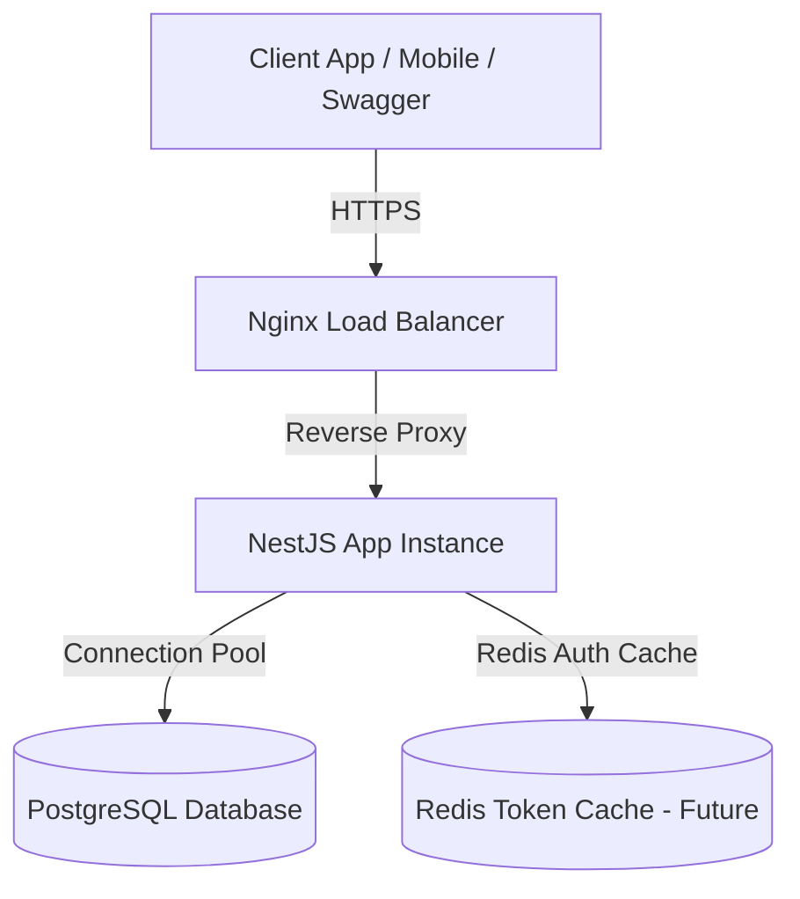
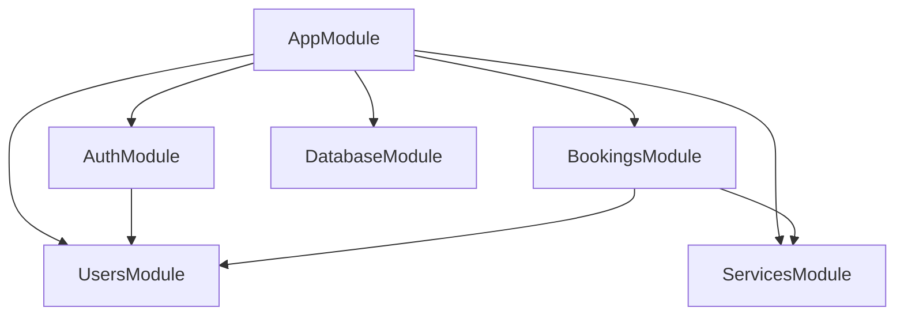
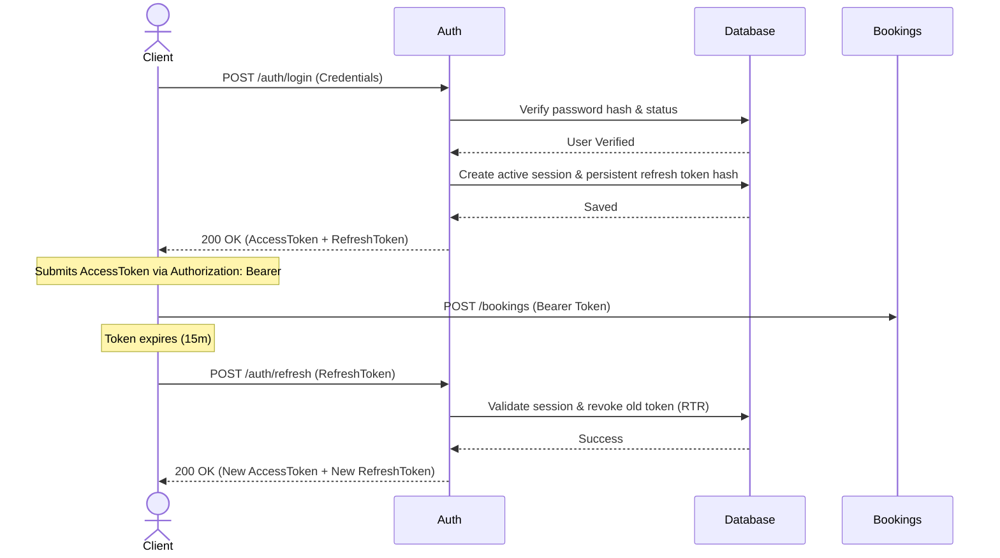
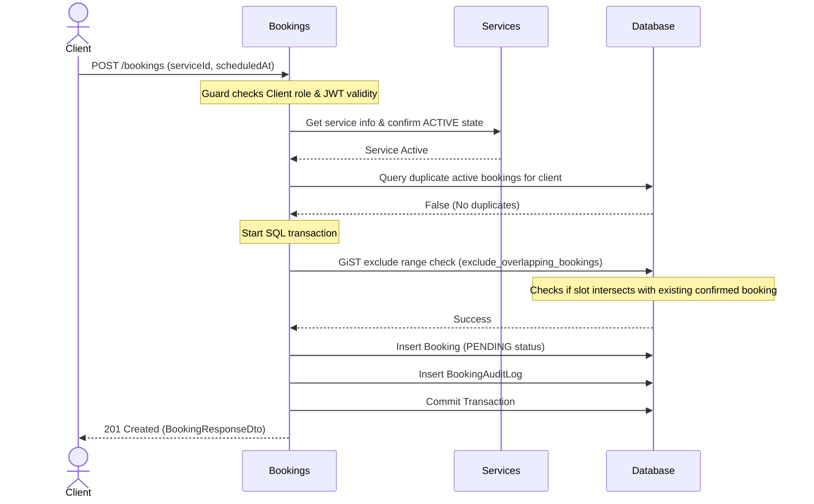
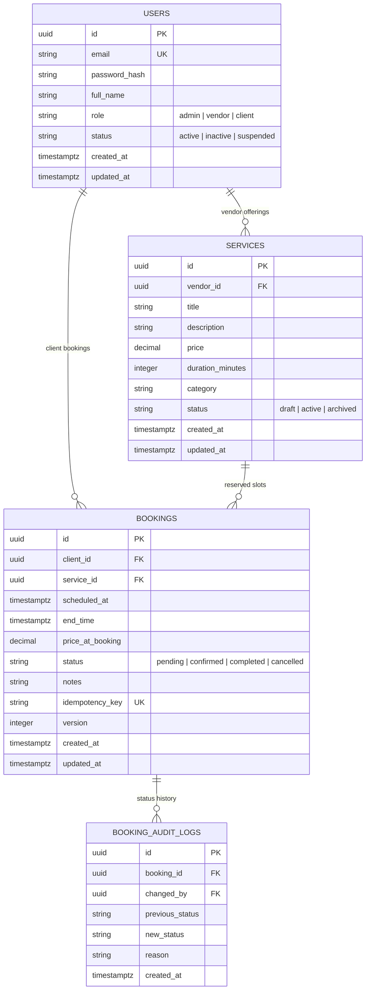
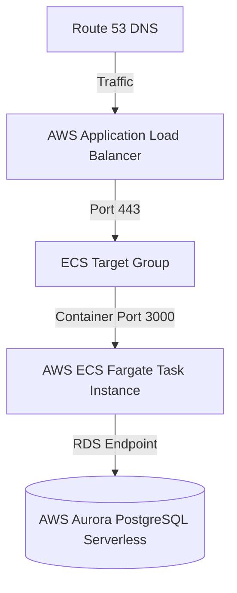

# SaaS Service Booking Platform API Backend

A production-grade, highly scalable NestJS scheduling backend designed for enterprise SaaS applications. Built using TypeScript, TypeORM, and PostgreSQL, this system implements secure JWT-based role authorization, atomic transactional booking slots, and pessimistic/optimistic concurrency protections.

---

## 1. System Architecture Diagrams

### System Architecture



### Module Dependency Diagram



### Request Lifecycle Diagram

```mermaid
graph LR
    Req[HTTP Request] --> Helmet[Helmet Headers]
    Helmet --> CORS[CORS Check]
    CORS --> GlobalFilters[HttpExceptionFilter]
    GlobalFilters --> JwtGuard[JwtAuthGuard]
    JwtGuard --> RolesGuard[RolesGuard]
    RolesGuard --> Pipe[ValidationPipe]
    Pipe --> Controller[Controller]
    Controller --> Service[Service Logic]
    Service --> Repos[Repository Data]
    Repos --> Res[JSON Response]
```



### Authentication Flow (JWT Refresh Token Rotation)



### Booking Creation Flow



### Database Entity Relationship (ER) Diagram



### Deployment Architecture



---

## 2. Directory Structure

```
src/
├── main.ts                     # Bootstrap sequence (Helmet, CORS, Validation, Swagger)
├── app.module.ts               # Root imports, Joi validation schema injection
├── config/                     # Type-safe configuration namespaces
│   ├── app.config.ts
│   ├── database.config.ts
│   ├── auth.config.ts
│   └── validation.schema.ts
├── database/                   # Migrations, seeders, and programmatic DataSource configuration
│   ├── data-source.ts          # TypeORM CLI DataSource configuration
│   └── migrations/
├── common/                     # Stateless shared components
│   ├── filters/                # Global exception translation filter
│   ├── guards/                 # JwtAuthGuard, RolesGuard
│   ├── decorators/             # CurrentUser, Public decorators
│   └── utils/                  # Cryptographic utilities (Bcrypt helpers)
├── auth/                       # Authentication and JWT session module
├── users/                      # User profile module
├── services/                   # Service catalog module
└── bookings/                   # Bookings state-machine module
```

---

## 3. Technology Stack

- **Framework**: [NestJS](https://nestjs.com/) (Modular architecture, IoC container)
- **Language**: [TypeScript](https://www.typescript.org/) (Strict compilation configurations)
- **Database**: [PostgreSQL](https://www.postgresql.org/) (Exclusion constraints & concurrent range checks)
- **ORM**: [TypeORM Pattern](https://typeorm.io/) (Data Source pattern, CLI programmatic migration files)
- **Security**: [Helmet](https://helmetjs.github.io/), CORS, Bcrypt hashing, refresh token rotation (RTR)
- **Testing**: [Jest](https://jestjs.io/) (Unit tests coverage > 95%), Supertest (E2E integrations)
- **Containerization**: [Docker & Docker Compose](https://www.docker.com/)

---

## 4. Installation & Getting Started

### Prerequisites
- Node.js (v22 or higher)
- Docker & Docker Compose
- PostgreSQL (if running locally without Docker)

### Running Locally

1. **Clone the Repository**
   ```bash
   git clone <repository_url>
   cd EdProject
   ```

2. **Configure Environment Variables**
   Copy the example file to `.env`:
   ```bash
   cp .env.example .env
   ```

3. **Install Dependencies**
   ```bash
   npm install
   ```

4. **Start PostgreSQL Database**
   You can run a local PostgreSQL container:
   ```bash
   docker compose up db -d
   ```

5. **Run Migrations**
   ```bash
   npm run migration:run
   ```

6. **Seed Database**
   Populate users and mock services:
   ```bash
   npm run seed
   ```

7. **Start NestJS in Development Mode**
   ```bash
   npm run start:dev
   ```
   The API will start at: `http://localhost:3000/api/v1`
   Swagger docs: `http://localhost:3000/api/docs`

---

## 5. Running with Docker Container

1. **Build and Run All Services (NestJS App, PostgreSQL DB)**
   ```bash
   docker compose up --build -d
   ```

2. **Access Development Panels**
   - API endpoints: `http://localhost:3000/api/v1`
   - Swagger documentation: `http://localhost:3000/api/docs`
   - pgAdmin: `http://localhost:5050` (Email: `admin@example.com`, Password: `adminpassword` - optional dev profile)
     *To start dev profile services*: `docker compose --profile dev up -d`

3. **Shutdown Services**
   ```bash
   docker compose down -v
   ```

---

## 6. Running Tests

- **Unit Tests**:
  ```bash
  npm run test
  ```
- **E2E Tests**:
  ```bash
  npm run test:e2e
  ```
- **Test Coverage**:
  ```bash
  npm run test:cov
  ```

---

## 7. Migration Commands

To generate or run database migrations using TypeORM:
- **Run migrations**: `npm run migration:run`
- **Revert last migration**: `npm run migration:revert`
- **Generate new migration**: `npm run migration:generate --name=AddMoreIndexes`

---

## 8. Deployment Guide

### Environment Variables (.env)
Ensure these secrets are set on production platforms (e.g. AWS Secrets Manager, GitHub Secrets):
- `DATABASE_HOST` / `DATABASE_PASSWORD`
- `JWT_SECRET` / `JWT_REFRESH_SECRET`

### Deployment Platforms
- **Docker Compose (Virtual Machine / EC2)**:
  Use a reverse proxy like Nginx or Caddy to handle SSL (Port 443) termination, forwarding traffic to port 3000.
- **Render / Railway / Fly.io**:
  Add PostgreSQL as a managed service, configure environment secrets, and point the build target to Dockerfile.

---

## 9. Security & Concurrency Design

- **Helmet Headers**: Configured globally in bootstrap main to block clickjacking and MIME Sniffing.
- **OWASP protections**: Validates input schemas using class-validator decorators, preventing SQL Injection via TypeORM placeholder parameter bindings.
- **Overlapping Booking Exclusions**: PostgreSQL ranges checking prevents concurrent double bookings for the same service slot:
  ```sql
  ALTER TABLE bookings ADD CONSTRAINT exclude_overlapping_bookings 
  EXCLUDE USING gist (
    service_id WITH =,
    tstzrange(scheduled_at, end_time) WITH &&
  ) WHERE (status IN ('pending', 'confirmed'));
  ```
